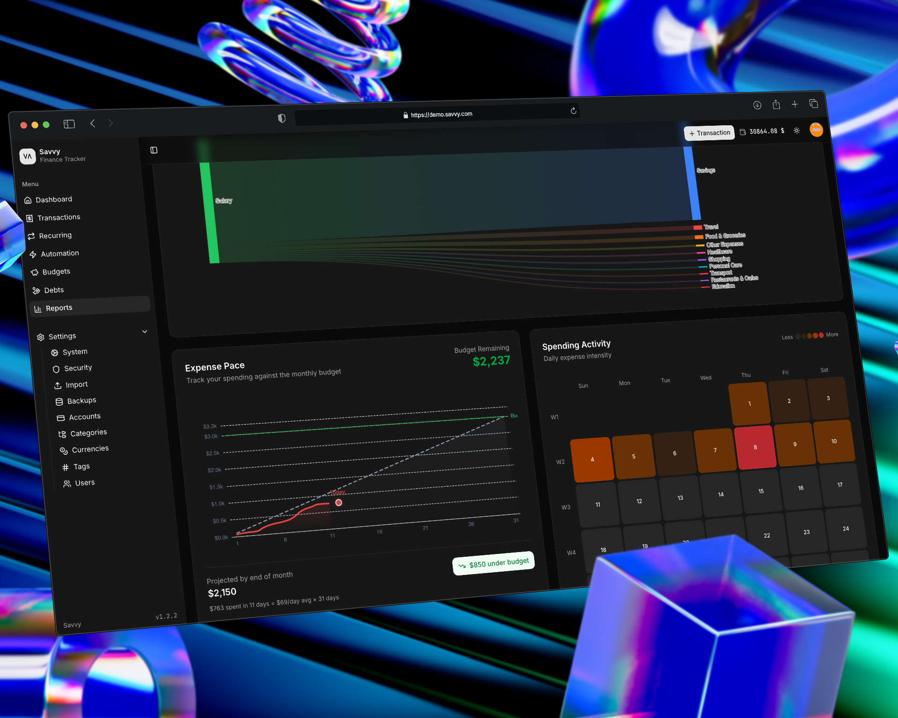

<p align="center">
  
  
</p>

<h1 align="center">Savvy</h1>

<p align="center">
  Selfhosted expense tracker with full multi-currency support. One container — done.
</p>

<p align="center">
<a href="https://hub.docker.com/r/truenormis/savvy"></a>


</p>

<p align="center">
  
</p>

## ⚡ Quick Start
```bash
docker run -d -p 3000:80 -v savvy-data:/data truenormis/savvy:latest
```

Open `localhost:3000`.

## ✨ Features

- **Multi-currency** — any fiat or crypto, transfers between them
- **Auto exchange rates** — currency rates updated automatically via API
- **Recurring transactions** — scheduled payments (daily, weekly, monthly, yearly)
- **Automation rules** — auto-categorize transactions based on conditions
- **Debts** — track loans and borrowings with payment history
- **Budgets** — set limits and track progress
- **Categories & tags** — flexible organization
- **Multi-user** — share with family or team, role-based access (admin/user)
- **Rich analytics** — Sankey diagrams, heatmaps, net worth tracking, expense pace
- **CSV import** — import transactions from bank exports with duplicate detection
- **Backups** — create, restore and download database backups
- **2FA** — two-factor authentication via TOTP (Google Authenticator, etc.)

<p align="center">
  
</p>

## 🔒 Privacy

Your data stays with you. SQLite stored in `/data`.

## 🛠 Stack

Laravel • SQLite • Docker

## 📄 License

MIT
