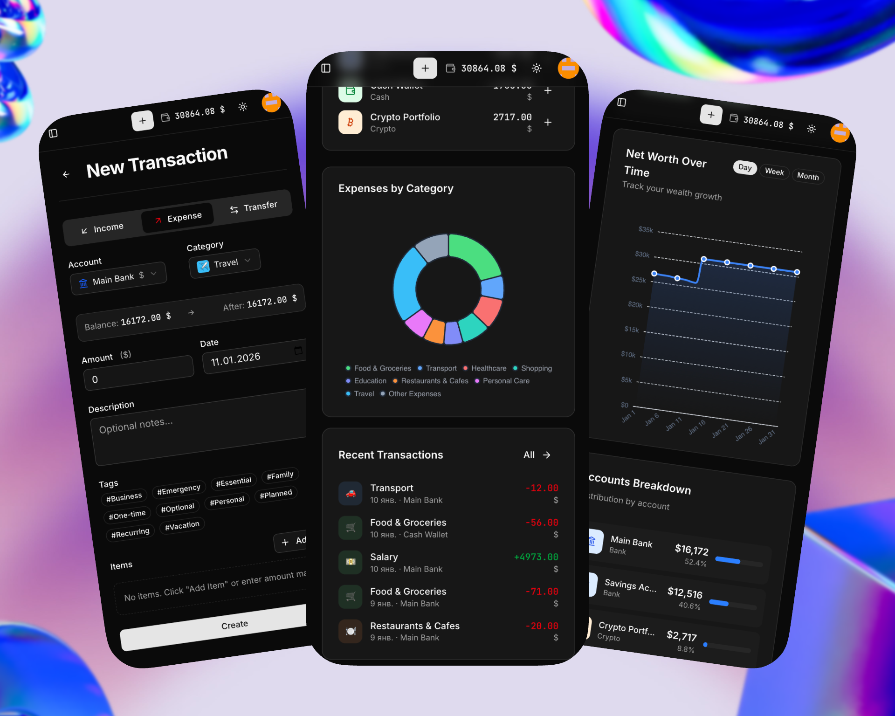

<p align="center">
  
  
</p>

<h1 align="center">Savvy</h1>

<p align="center">
  Selfhosted expense tracker with full multi-currency support. One container — done.
</p>

<p align="center">
<a href="https://hub.docker.com/r/truenormis/savvy"></a>


</p>

<div align="center">

### 🎮 Try it now!

<a href="https://demo.savvy.whiteforge.ai">
  
</a>

🔐 `demo@demo.com` / `demo`

</div>

---

<p align="center">
  
</p>

## ⚡ Quick Start
```bash
docker run -d -p 3000:80 -v savvy-data:/data truenormis/savvy:latest
```

Open `localhost:3000` and create your account.

## ✨ Features

- **Multi-currency** — any fiat or crypto, transfers between them
- **Auto exchange rates** — currency rates updated automatically via API
- **Recurring transactions** — scheduled payments (daily, weekly, monthly, yearly)
- **Automation rules** — auto-categorize transactions based on conditions
- **Debts** — track loans and borrowings with payment history
- **Budgets** — set limits and track progress
- **Categories & tags** — flexible organization
- **Multi-user** — share with family or team, role-based access (admin/user)
- **Rich analytics** — Sankey diagrams, heatmaps, net worth tracking, expense pace
- **CSV import** — import transactions from bank exports with duplicate detection
- **Backups** — create, restore and download database backups
- **2FA** — two-factor authentication via TOTP (Google Authenticator, etc.)

<p align="center">
  
</p>

## 📱 Mobile-Friendly

Fully responsive design built with ShadCN/UI — track expenses from your phone right after purchase.

<p align="center">
  
  &nbsp;&nbsp;&nbsp;
</p>

## 🚀 Deployment

### Docker Compose (Recommended)
```yaml
version: "3.8"

services:
  savvy:
    image: truenormis/savvy:latest
    container_name: savvy
    restart: unless-stopped
    ports:
      - "3000:80"
    volumes:
      - savvy-data:/data
    environment:
      - APP_URL=https://savvy.yourdomain.com
      - TZ=Europe/Kyiv

volumes:
  savvy-data:
```

### Environment Variables

| Variable  | Description                 | Default            |
|-----------|-----------------------------|--------------------|
| `APP_URL` | Public URL of your instance | `http://localhost` |
| `TZ`      | Timezone                    | `UTC`              |
### With Traefik (HTTPS)
```yaml
version: "3.8"

services:
  savvy:
    image: truenormis/savvy:latest
    container_name: savvy
    restart: unless-stopped
    volumes:
      - savvy-data:/data
    environment:
      - APP_URL=https://savvy.yourdomain.com
      - TZ=Europe/Kyiv
    labels:
      - "traefik.enable=true"
      - "traefik.http.routers.savvy.rule=Host(`savvy.yourdomain.com`)"
      - "traefik.http.routers.savvy.entrypoints=websecure"
      - "traefik.http.routers.savvy.tls.certresolver=letsencrypt"
      - "traefik.http.services.savvy.loadbalancer.server.port=80"
    networks:
      - traefik

volumes:
  savvy-data:

networks:
  traefik:
    external: true
```

### With Nginx Proxy Manager

1. Run Savvy on internal port:
```yaml
version: "3.8"

services:
  savvy:
    image: truenormis/savvy:latest
    container_name: savvy
    restart: unless-stopped
    expose:
      - "80"
    volumes:
      - savvy-data:/data
    environment:
      - APP_URL=https://savvy.yourdomain.com
    networks:
      - npm-network

volumes:
  savvy-data:

networks:
  npm-network:
    external: true
```

2. In Nginx Proxy Manager, create proxy host pointing to `savvy:80`

### Kubernetes

Savvy works out of the box on Kubernetes. Deploy as a single-pod Deployment with a PersistentVolumeClaim mounted at `/data`. Helm chart coming soon.

## 🔄 Updating
```bash
docker compose pull
docker compose up -d
```

Your data is safe in the `/data` volume.

## 💾 Backups

Backups can be managed directly from the UI (Settings → Backups).

Manual backup:
```bash
docker cp savvy:/data/database.sqlite ./backup-$(date +%Y%m%d).sqlite
```

Restore:
```bash
docker cp ./backup.sqlite savvy:/data/database.sqlite
docker restart savvy
```

## 🔒 Privacy

Your data stays with you. SQLite database stored in `/data` volume — no external services required.

## 🛠 Stack

Laravel • SQLite • Docker • ShadCN/UI • Tailwind CSS

## 🤝 Contributing

Contributions are welcome! Please open an issue first to discuss what you would like to change.

## 📄 License

[MIT](LICENSE)

---

<p align="center">
  Made with ❤️ for people who want control over their finances
</p>
