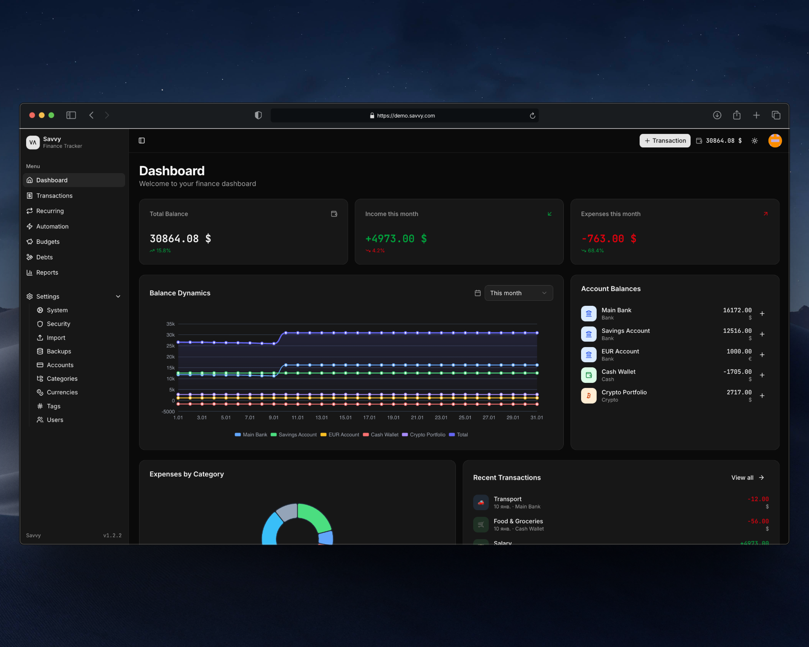

<p align="center">
  <picture>
    <source media="(prefers-color-scheme: dark)" srcset="docs/images/logo-dark.svg">
    <source media="(prefers-color-scheme: light)" srcset="docs/images/logo-light.svg">
    
  </picture>
</p>

<h1 align="center">Savvy</h1>

<p align="center">
  Selfhosted expense tracker with full multi-currency support. One container — done.
</p>

<p align="center">
<a href="https://hub.docker.com/r/truenormis/savvy"></a>


</p>

<p align="center">
  
</p>

## ⚡ Quick Start
```bash
docker run -d -p 3000:80 -v savvy-data:/data truenormis/savvy:latest
```

Open `localhost:3000`.

## ✨ Features

- **Multi-currency** — any fiat or crypto, transfers between them
- **Base currency** — choose your own for reports
- **Debts** — track loans and borrowings
- **Categories & tags** — flexible organization
- **Budgets** — set and track limits
- **Analytics** — clear visual charts

## 🔒 Privacy

Your data stays with you. SQLite stored in `/data`.

## 🛠 Stack

Laravel • SQLite • Docker

## 📄 License

MIT
