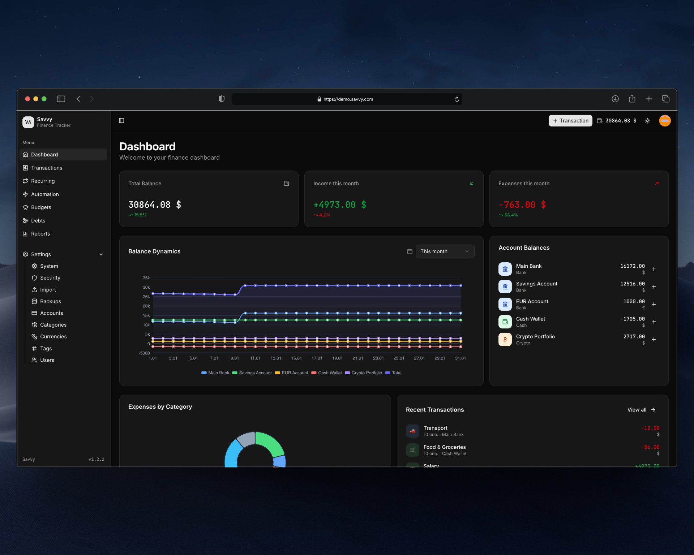
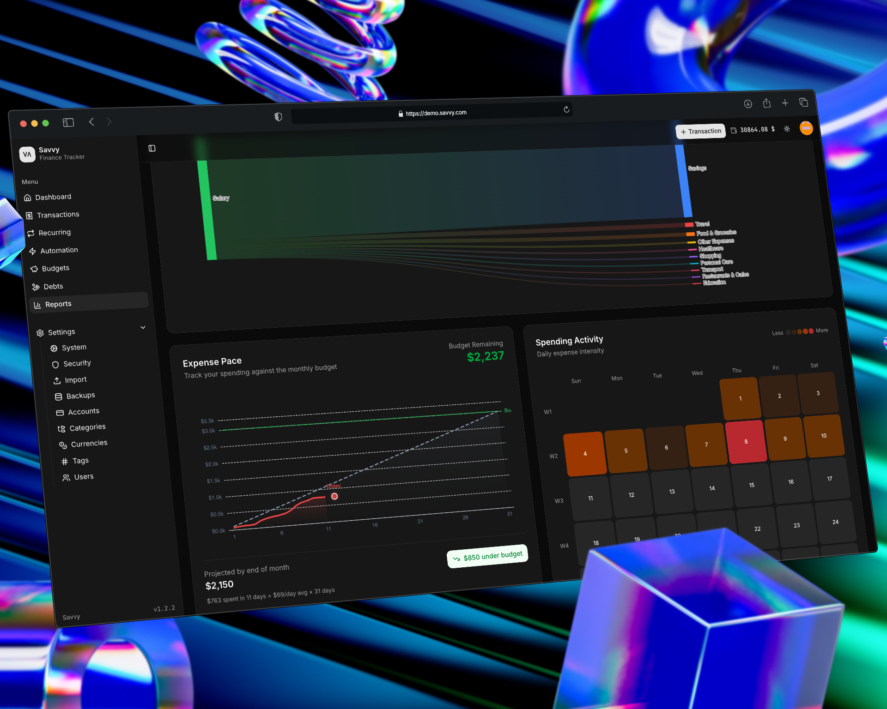
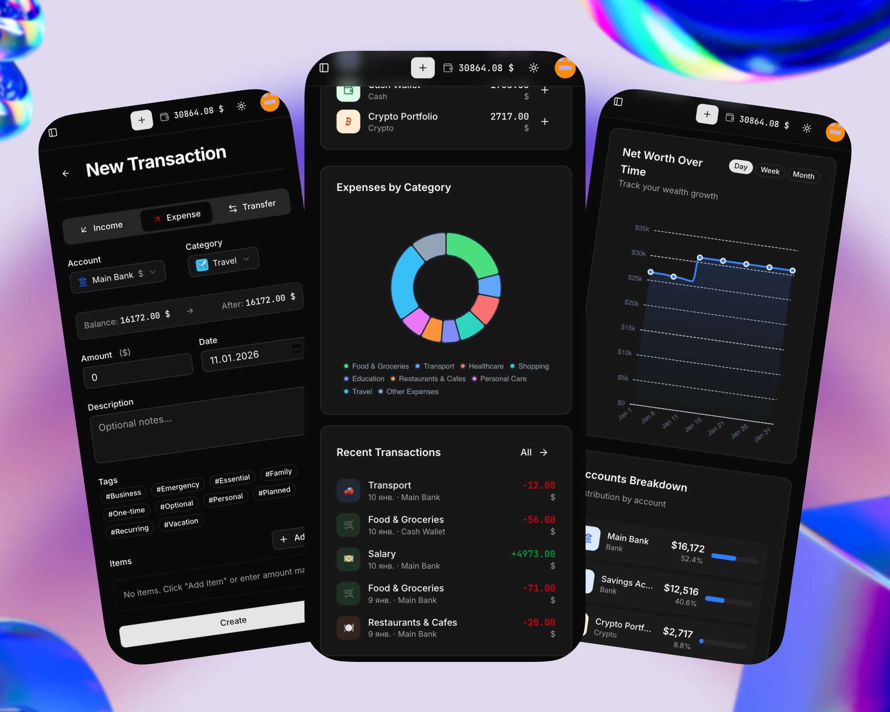

<p align="center">
  
  
</p>

<h1 align="center">Savvy</h1>

<p align="center">
  Selfhosted expense tracker with full multi-currency support. One container — done.
</p>

<p align="center">
<a href="https://hub.docker.com/r/truenormis/savvy"></a>


</p>

<div align="center">

### 🎮 Try it now!

<a href="https://demo.savvy.whiteforge.ai">
  
</a>

🔐 `demo@demo.com` / `demo`

</div>

---

<p align="center">
  
</p>

## ⚡ Quick Start
```bash
docker run -d -p 3000:80 -v savvy-data:/data truenormis/savvy:latest
```

Open `localhost:3000` and create your account.

## ✨ Features

- **Multi-currency** — any fiat or crypto, transfers between them
- **Auto exchange rates** — currency rates updated automatically via API
- **Recurring transactions** — scheduled payments (daily, weekly, monthly, yearly)
- **Automation rules** — auto-categorize transactions based on conditions
- **Debts** — track loans and borrowings with payment history
- **Budgets** — set limits and track progress
- **Categories & tags** — flexible organization
- **Multi-user** — share with family or team, role-based access (admin/user)
- **Rich analytics** — Sankey diagrams, heatmaps, net worth tracking, expense pace
- **CSV import** — import transactions from bank exports with duplicate detection
- **Backups** — create, restore and download database backups
- **2FA** — two-factor authentication via TOTP (Google Authenticator, etc.)

<p align="center">
  
</p>

## 📱 Mobile-Friendly

Fully responsive design built with ShadCN/UI — track expenses from your phone right after purchase.

<p align="center">
  
  &nbsp;&nbsp;&nbsp;
</p>

## 🚀 Deployment

### Docker Compose (Recommended)
```yaml
services:
  savvy:
    image: truenormis/savvy:latest
    container_name: savvy
    restart: unless-stopped
    ports:
      - "3000:80"
    volumes:
      - savvy-data:/data
    environment:
      - APP_URL=https://savvy.yourdomain.com
      - TZ=Europe/Kyiv
    healthcheck:
      test: ["CMD", "wget", "-q", "-O", "/dev/null", "http://127.0.0.1/livez"]
      interval: 10s
      timeout: 3s
      start_period: 60s
      retries: 3

volumes:
  savvy-data:
```

### Environment Variables

| Variable  | Description                 | Default            |
|-----------|-----------------------------|--------------------|
| `APP_URL` | Public URL of your instance | `http://localhost` |
| `TZ`      | Timezone                    | `UTC`              |

### Behind a Reverse Proxy

Set `APP_URL` to your public `https://` URL. Savvy honors the `X-Forwarded-Proto` and `X-Forwarded-For` headers from the proxy, so HTTPS link generation and real client IPs work automatically — no extra configuration needed.

### Health Checks

Two probe endpoints are exposed for orchestrators and uptime monitoring (responses use the IETF `application/health+json` format):

| Endpoint  | Purpose                                                                     | Healthy | Unhealthy |
|-----------|-----------------------------------------------------------------------------|---------|-----------|
| `/livez`  | Liveness — the app process is up. Use it for container restart decisions.   | `200`   | —         |
| `/readyz` | Readiness — database is reachable and migrations are applied. Gate traffic. | `200`   | `503`     |

`/livez` stays up during maintenance mode; `/readyz` returns `503` so traffic drains while the instance is not ready.

### With Traefik (HTTPS)
```yaml
services:
  savvy:
    image: truenormis/savvy:latest
    container_name: savvy
    restart: unless-stopped
    volumes:
      - savvy-data:/data
    environment:
      - APP_URL=https://savvy.yourdomain.com
      - TZ=Europe/Kyiv
    labels:
      - "traefik.enable=true"
      - "traefik.http.routers.savvy.rule=Host(`savvy.yourdomain.com`)"
      - "traefik.http.routers.savvy.entrypoints=websecure"
      - "traefik.http.routers.savvy.tls.certresolver=letsencrypt"
      - "traefik.http.services.savvy.loadbalancer.server.port=80"
    networks:
      - traefik

volumes:
  savvy-data:

networks:
  traefik:
    external: true
```

### With Nginx Proxy Manager

1. Run Savvy on internal port:
```yaml
services:
  savvy:
    image: truenormis/savvy:latest
    container_name: savvy
    restart: unless-stopped
    expose:
      - "80"
    volumes:
      - savvy-data:/data
    environment:
      - APP_URL=https://savvy.yourdomain.com
    networks:
      - npm-network

volumes:
  savvy-data:

networks:
  npm-network:
    external: true
```

2. In Nginx Proxy Manager, create proxy host pointing to `savvy:80`

### Kubernetes

Deploy as a single-replica `Deployment` with a `PersistentVolumeClaim` mounted at `/data`. SQLite is single-writer, so use `strategy: { type: Recreate }`. The container runs as non-root (`www-data`, uid 82) — grant `NET_BIND_SERVICE` so it can bind port 80. Wire the probes to the health endpoints:

```yaml
        startupProbe:
          httpGet: { path: /livez, port: 80 }
          periodSeconds: 3
          failureThreshold: 30
        livenessProbe:
          httpGet: { path: /livez, port: 80 }
          periodSeconds: 10
        readinessProbe:
          httpGet: { path: /readyz, port: 80 }
          periodSeconds: 10
```

### Helm

A production-grade chart is published to the ChartMuseum repository at
`https://charts.trysavvy.dev`:

```bash
helm repo add savvy https://charts.trysavvy.dev
helm repo update
helm install savvy savvy/savvy -n savvy --create-namespace
```

See [`deploy/helm/savvy/README.md`](deploy/helm/savvy/README.md) for values and
design notes.

## 🔄 Updating
```bash
docker compose pull
docker compose up -d
```

Your data is safe in the `/data` volume.

## 💾 Backups

Backups can be managed directly from the UI (Settings → Backups).

> [!WARNING]
> The database runs in **WAL mode**, so recent writes may still live in the `database.sqlite-wal` file and **won't be in `database.sqlite` yet**. Copying `database.sqlite` alone can silently lose the latest data. Always checkpoint the WAL into the main file first (or use the in-app backup, which handles this for you).

Manual backup:
```bash
# Fold the WAL into the main file, then copy
docker exec savvy php artisan tinker --execute="DB::statement('PRAGMA wal_checkpoint(TRUNCATE);');"
docker cp savvy:/data/database.sqlite ./backup-$(date +%Y%m%d).sqlite
```

Restore (stop writers first so the WAL doesn't fight the swap):
```bash
docker compose down
docker cp ./backup.sqlite savvy:/data/database.sqlite
docker compose up -d
```

## 🔒 Privacy

Your data stays with you. SQLite database stored in `/data` volume — no external services required.

## ⚙️ How It Works

One container runs everything under Supervisor — Nginx, PHP-FPM, the scheduler (recurring transactions, automatic exchange-rate updates) and a queue worker for background jobs. SQLite lives in `/data`; no external database, cache, or queue service is required. Migrations run automatically on startup.

## 🛠 Stack

Laravel • SQLite • Docker • ShadCN/UI • Tailwind CSS

## 🤝 Contributing

Contributions are welcome! Please open an issue first to discuss what you would like to change.

## 📄 License

[MIT](LICENSE)

---

<p align="center">
  Made with ❤️ for people who want control over their finances
</p>
